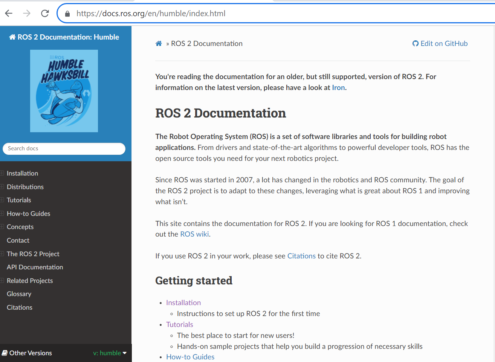

As discussed in Readme, we will install the Humble Hawkbill, the stable and currently supported distribution of ROS2 released on May 23rd 2022 with an End of Life (EOL) date of May 2027. The steps for installation are as follows : 

Step 1 : Go to official documentation of ROS2-Humble Hawkbill distribution and click on Installation :  
```
https://docs.ros.org/en/humble/index.html
```
<p align="center">
  
</p>

Step 2 : There are 2 ways of installation : using binary packages or build from source. We will select the install from Debian Binary Packages. 
<p align="center">
  
</p>

Step 3 : Set locale which supports UTF-8. (or minimal like POSIX) with the following commands : 

Check for UTF-8 :
```
locale
```

<p align="center">
  
</p>
Next install locales, it will take a while :

```
sudo apt update && sudo apt install locales
```

<p align="center">
  
</p>

```
sudo locale-gen en_US en_US.UTF-8
```

<p align="center">
  
</p>

```
sudo update-locale LC_ALL=en_US.UTF-8 LANG=en_US.UTF-8
export LANG=en_US.UTF-8

locale  # verify settings
```

<p align="center">
  
</p>

Step 4 : Setup sources to add the ROS 2 apt repository to system
First ensure that the Ubuntu Universe repository is enabled.

```
sudo apt install software-properties-common
sudo add-apt-repository universe
```

Step 5 : Add the ROS 2 GPG key with apt

```
sudo apt update && sudo apt install curl -y
sudo curl -sSL https://raw.githubusercontent.com/ros/rosdistro/master/ros.key -o /usr/share/keyrings/ros-archive-keyring.gpg
```

Step 6 : Add the repository to sources list

```
echo "deb [arch=$(dpkg --print-architecture) signed-by=/usr/share/keyrings/ros-archive-keyring.gpg] http://packages.ros.org/ros2/ubuntu $(. /etc/os-release && echo $UBUNTU_CODENAME) main" | sudo tee /etc/apt/sources.list.d/ros2.list > /dev/null
```

Step 7 : Install ROS2 packages
Update apt repository caches after setting up the repositories

```
sudo apt update
```

Ensure system is up to date before installing new packages

```
sudo apt upgrade
```

Now we have 2 choices to install ROS2 : either Desktop Install or ROS-Base. Desktop Install includes GUI tools such as RViz, demos and tutorials whereas ROS-Base is bare bones which includes communication libraries, message packages and CLI but not GUI tools. 
We proceed to install ROS2 Desktop Install 

```
sudo apt install ros-humble-desktop
```

Next install development tools: compilers and other tools to build ROS packages

```
sudo apt install ros-dev-tools
```


### Notes :
1. We selected the install from Debian Binary Packages since it results in a fully-functional and usable ROS2 and alos it is more convenient because it installs its necessary dependencies automatically and updates alongside regular system updates. On the other hand, building from source is for developers looking to alter or explicitly omit parts of ROS 2’s base. It is also recommended for platforms that don’t support binaries. Building from source also gives you the option to install the absolute latest version of ROS 2.

2. For Debian, access to root is essential. If root access is not available, select install from 'fat' drive. Also, debian is exclusive to Ubuntu, for mac or Windows, install from 'fat' drive.
   
3.  


