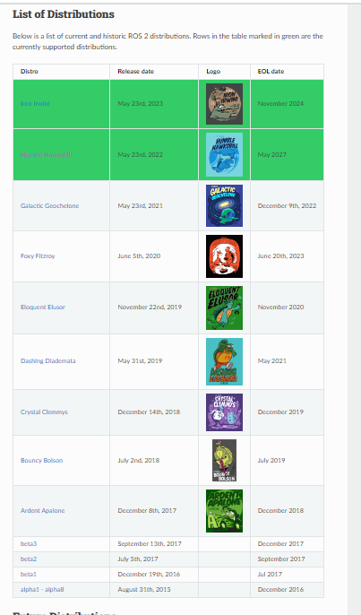
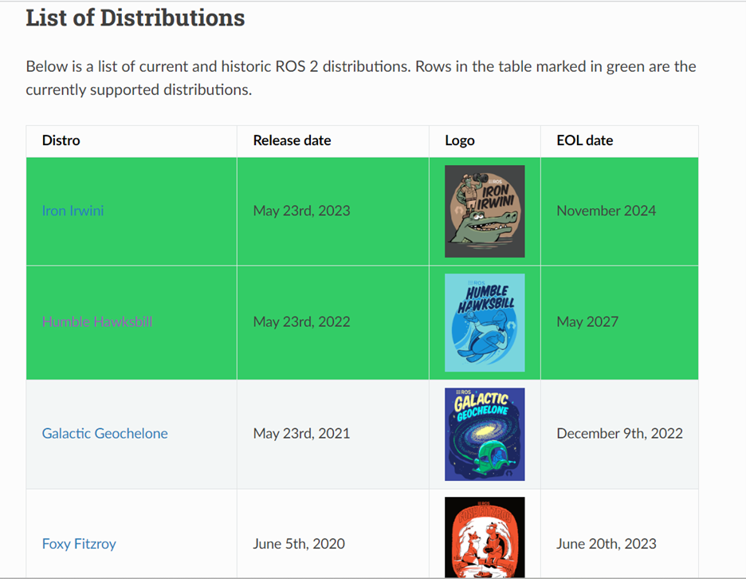
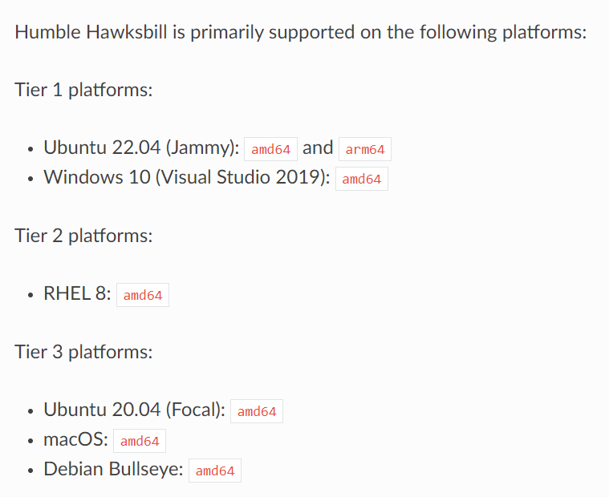

# ROS2 Humble Hawkbill Installation Guide for Ubuntu 22.04 LTS

### What is ROS and why is it used?  

The Robot Operating System (ROS) is a set of software libraries and tools that help you build robot applications. From drivers to state-of-the-art algorithms, and with powerful developer tools, ROS has what you need for your next robotics project. And it's all open source. For over 10+ years the ROS project has produced a vast ecosystem of software for robotics by nurturing a global community of millions of developers and users who contribute to and improve that software. ROS is developed by and for that community, who will be its stewards into the future. ROS provides the tools, libraries, and capabilities that you need to develop your robotics applications, allowing you to spend more time on the work that is important for your business. Because it is open-source, you have the flexibility to decide where and how to use ROS, as well as the freedom to customize it for your needs. Moreover, ROS isn’t exclusive, you don’t need to choose between ROS or some other software stack; ROS easily integrates with your existing software to bring its tools to your problem. ROS is ready for use across a wide array of robotics applications, from indoor to outdoor, home to automotive, underwater to space, and consumer to industrial.

There is a new release of ROS distribution every year. 

### Before beginning the installation, we need to answer 2 questions based on our project and system requirements : Should we install ROS1 or ROS2? Which distribution of ROS should be installed?  

Even though ROS1 became extremely popular among the open source robotics community, it still lacked some of the most important requirements, such as real-time, safety, certification, security. Thus, came ROS2, to meet these requirements and be compatible with industrial applications. So, ROS1 is last supported on Ubuntu 20.04. Considering our use-case of Ubuntu22.04, ROS1 is no longer compatible. Thus, we will install ROS2 and not ROS1. 

Next, to decide which distribution of ROS2 to install, as seen below in the list of distributions from the ROS2 documentation, all distributions till Galactic Geocheclone have reached their EOL (End of Life).  

  

The 2 distributions highlighted in green i.e. Humble Hawkbill and Iron Irwini are the currently supported distributions : 

  

Looking at the details of the Humble distribution installation :

  

Ubuntu22.04 is a supported platform for ROS2 Humble distribution. 

### Thus, for our Ubuntu22.04, we will install ROS2-Humble Hawkbill distribution in this repo.

# Notes : 
## 1. Summary : 

Ubuntu18 -> ROS1 Melodic

Ubuntu20 -> ROS1 Noetic

Ubuntu22 -> ROS2 Humble / Iron  

## 2. If ROS1 is absolutely essential on Ubuntu22.04 : 

For ROS1 : ROS Noetic Ninjemys (release date: 2020) is the latest and final version of ROS1 was specifically designed to work with Ubuntu 20.04 (Focal Fossa) This final ROS1 version main’s goal is to provide Python3 support for developers/organizations who need to continue working with ROS1 for a while. It is not directly compatible with Ubuntu 22.04. and hence will lead to compatibility issues if used with Ubuntu 22.04. If it is still absolutely essential to use Noetic with Ubuntu 22.04, it can be docekerized for use. The steps for the same are outlined in this repo. However, it is important to note that Noetic on Ubuntu22 may not always work perfectly due to missing dependencies or other issues. ROS Noetic’s EOL (End of Life) is scheduled for 2025 i.e. any big code in ROS1 going beyond will need to be migrated to ROS2. 

## 3. If some functionality from ROS1 is needed along with ROS2 :

Two ways to tackle this sitation : 1. Use ROS2-ROS1 bridge. or 2. Use both ROS1-ROS2 multiple distribution installation on system. Refer ROS documentation for details. 

### References : 

[1] https://www.ros.org/

[2] https://docs.ros.org/en/humble/Installation.html

[3] https://docs.ros.org/en/humble/Installation/Alternatives/Ubuntu-Development-Setup.html

[4] https://docs.ros.org/en/foxy/Releases.html

[5] https://askubuntu.com/questions/1423932/ros-noetic-from-ubuntu-20-04-to-ubuntu-22-04#:~:text=ROS%20Noetic%20will%20be%20the,will%20only%20support%20Ubuntu%2020.04.

[6] https://devicetests.com/ros-noetic-compatible-ubuntu-22-04-guide#google_vignette

[7] https://roboticsbackend.com/ros1-vs-ros2-practical-overview/

